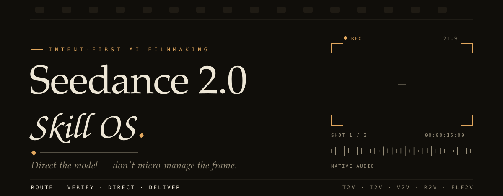
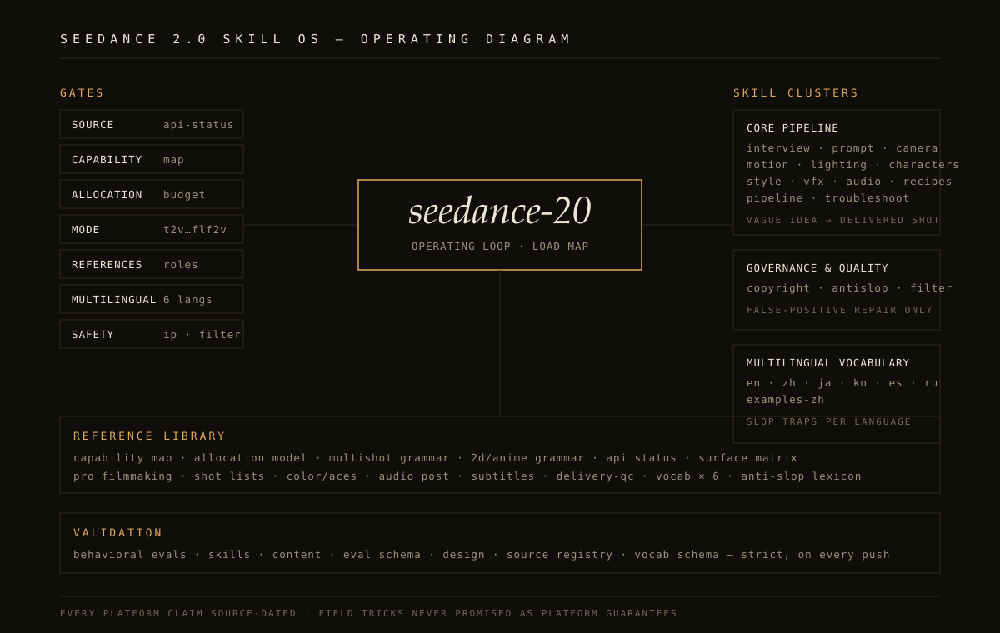
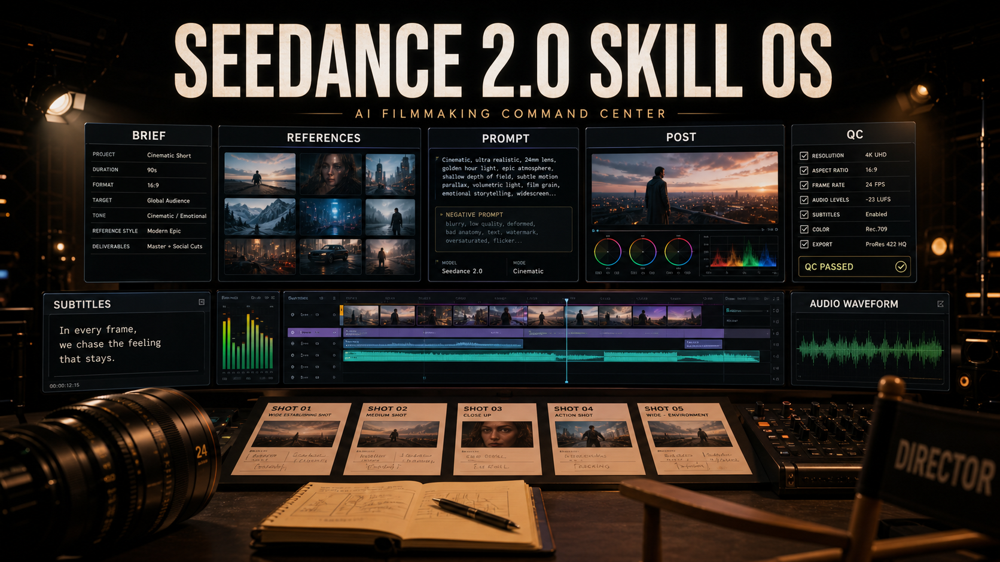
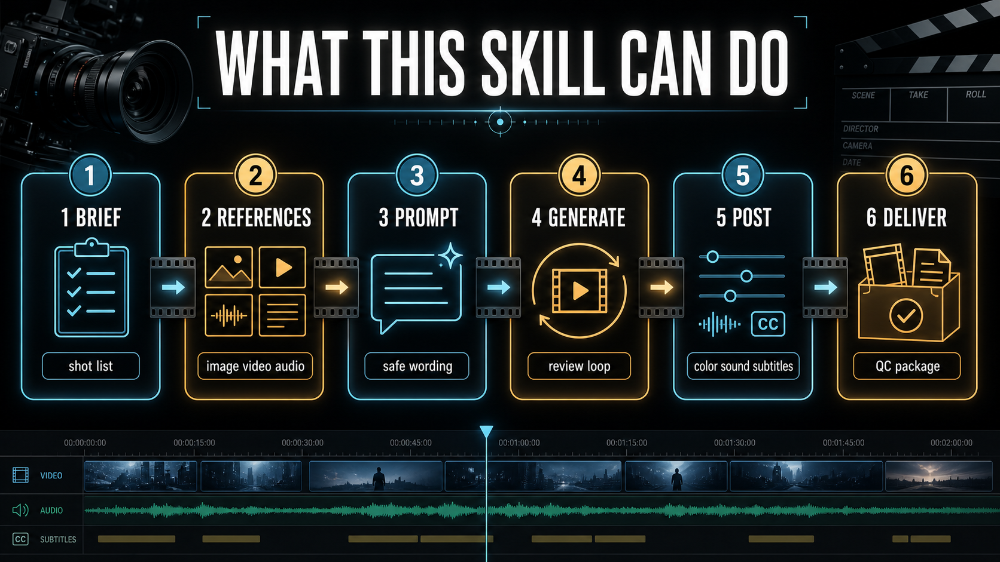
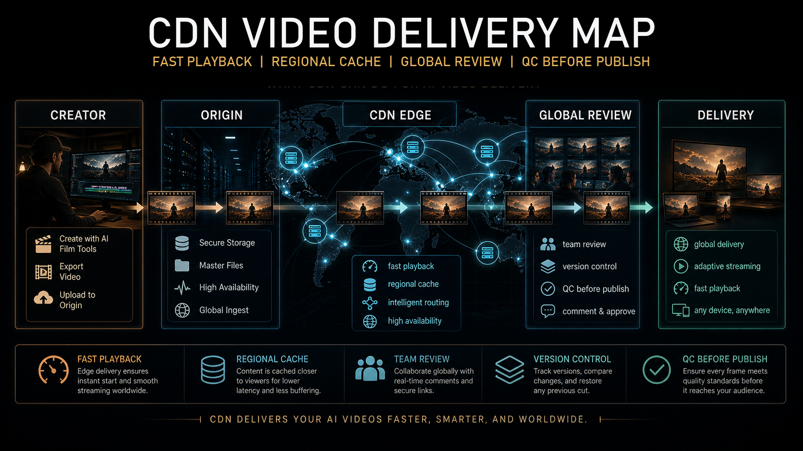
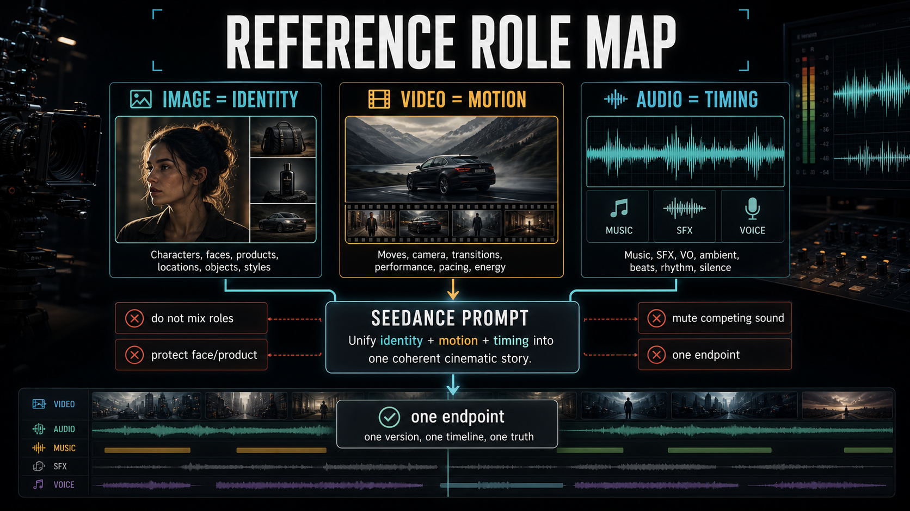
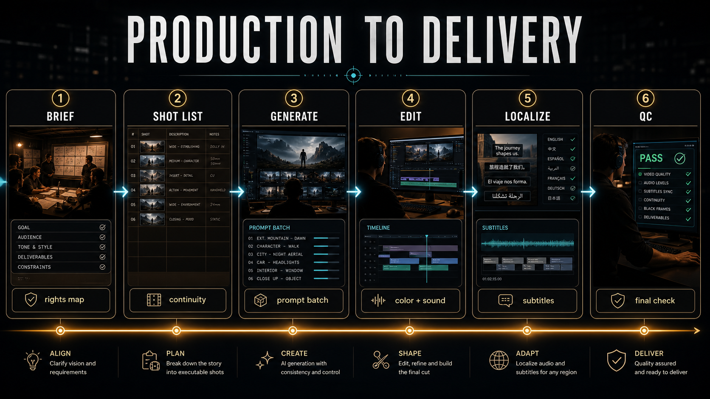
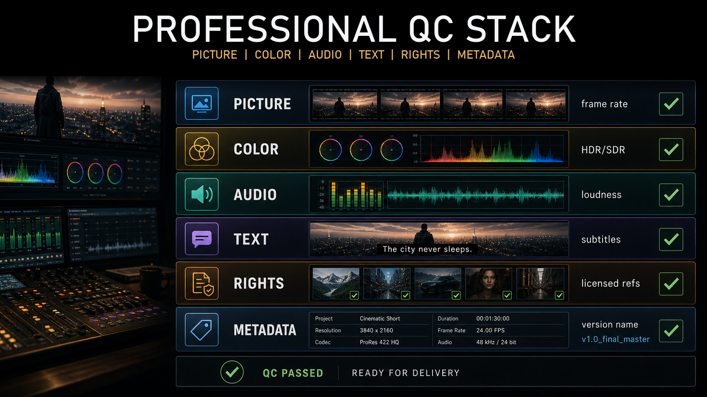

<!-- AUTO-TRANSLATED: 源文件 = ../../README.md ; 最后同步 = 2026-07-06 -->
<!-- 校对状态: draft -->
<!-- 术语表: references/vocab/zh.md -->

<div align="center">

<picture>
  <source media="(prefers-color-scheme: dark)" srcset="../../assets/hero-dark.svg">
  <source media="(prefers-color-scheme: light)" srcset="../../assets/hero-light.svg">
  
</picture>

# Seedance 2.0 Skill OS

**指挥模型，而不是逐帧微操。**

像电影导演一样指挥 Seedance 2.0 的智能体——动笔前先读懂每一场戏。<br>支持文本、图像、视频以及带原生音频的视频参考，提供 IP 安全改写、源数据日期化的平台事实，以及面向英语、**中文**、日本語、한국语的母语读者路径。

[](#changelog)
[](#skill-map)
[](#reference-library)
[](#validation)
[](../../LICENSE)

[从这里开始](#start-here) · [技能地图](#skill-map) · [参考库](#reference-library) · [视觉画廊](#visual-gallery) · [安装](#install)

[English](../../README.md) · **中文** · [日本語](../README.ja.md) · [한국어](../README.ko.md)

</div>

作者：[Iamemily2050 (@iamemily2050)](https://github.com/Emily2040) · [Instagram](https://instagram.com/iamemily2050) · [X](https://x.com/iamemily2050) · [个人网站](https://iamemily2050.com)

平台上下文：[ByteDance Seedance 2.0](https://seed.bytedance.com/en/seedance2_0) · Dreamina · 即梦 · 豆包 · [火山引擎方舟](https://www.volcengine.com/docs/82379/2291680?lang=zh) · [BytePlus ModelArk](https://docs.byteplus.com/en/docs/ModelArk/2291680) · [Runway Seedance 2](https://docs.dev.runwayml.com/guides/models/) · fal · 提供商/路由平台详见 [`platform-surface-matrix.md`](../../references/platform-surface-matrix.md)

更新于：**2026-06-29** · **v6.3.0 音频架构研究：每种语言的对白承载力与语音参考唇形同步路径**

---

## 指挥场景，而不是装饰场景

大多数工具只向模型索取"电影感"的外观。导演则会先问这场戏**在做什么**——然后让摄影机、镜头、灯光、走位、表演和声音都服务于同一个意图，并以同一可识别的声音贯穿整个故事。

[**导演引擎**](../../references/directing-engine.md) 将这种判断编码为方法。它读取一场戏的戏剧功能——转折、视角、权力、潜台词——命名一个意图，并衍生出一套统一的设置，而不是堆砌形容词。

**只求"电影感"：** `一个史诗级电影感的女人读信镜头，情绪化，柔美灯光`

**真正的执导：** `中近景，平视；她放下信，双手静止，缓慢推镜接近；身后柔和的窗光让面部保持平淡；近乎无声，只有一声椅子刮擦——领悟落在静止的双手上，而不是任何台词。`

随后在长故事的每一段短片里都保持同一种导演声音，并随附 **35 个完整推导范例** ——产品、MV、恐怖、动画、动作、喜剧、纪录片、高端时尚、科幻等，端到端展示。

> 揭示场景的灯光、构图、走位和表演方式，都不应与告别场景相同。导演引擎拒绝泛化答案，推导具体答案。

## 母语入门 / 多语言入门 / 多言語スタート / 다국어 시작

Seedance 2.0 Skill OS 支持英文阅读，但 v6 系列为中文、日文和韩文读者提供了一流的入口、活跃的示例技能和母语提示词指导。在所有语言中，请保持参考标签原样（`[Image1]`、`[Video1]`、`[Audio1]`、`@图1`、`@视频1`）。

| 语言 | 入门路径 | 母语读者提示 |
|---|---|---|
| English | [`seedance-prompt`](../../skills/seedance-prompt/SKILL.md), [`seedance-sequence`](../../skills/seedance-sequence/SKILL.md), [`references/vocab/en.md`](../../references/vocab/en.md) | 使用精确的制作英语：一个可见的节拍、一个摄影机运动、真实的光线、清晰的参考角色。 |
| 中文 | [`中文指南`](README.md), [`seedance-vocab-zh`](../../skills/seedance-vocab-zh/SKILL.md), [`seedance-examples-zh`](../../skills/seedance-examples-zh/SKILL.md), [`references/vocab/zh.md`](references/vocab/zh.md) | 中文用户可从角色锁定、首尾帧、运镜、动作节奏入手；提示词要短而具体，保留参考标签，不要让模型生成字幕。 |
| 日本語 | [`日本語ガイド`](../README.ja.md), [`seedance-vocab-ja`](../../skills/seedance-vocab-ja/SKILL.md), [`seedance-examples-ja`](../../skills/seedance-examples-ja/SKILL.md), [`references/vocab/ja.md`](../../references/vocab/ja.md) | 日本語では、人物の同一性、衣装、構図、動きの終点を明確に書き、字幕や広告コピーは後処理で追加します。 |
| 한국어 | [`한국어 가이드`](../README.ko.md), [`seedance-vocab-ko`](../../skills/seedance-vocab-ko/SKILL.md), [`seedance-examples-ko`](../../skills/seedance-examples-ko/SKILL.md), [`references/vocab/ko.md`](../../references/vocab/ko.md) | 한국어 프롬프트는 인물 고정, 카메라 움직임, 조명, 사운드를 짧게 분리하고 자막과 문구는 편집 단계에서 넣습니다. |

在任何语言中创作更长故事时，先从 [`seedance-sequence`](../../skills/seedance-sequence/SKILL.md) 开始。要承接一段已接受的片段继续拍摄，使用 [`seedance-continuation`](../../skills/seedance-continuation/SKILL.md) 并在写下一段提示词前先更新观察到的最终状态。

## 这个仓库为什么存在

Seedance 2.0 Skill OS 是一个模块化的智能体技能包，用于执导 Seedance 2.0 视频生成。它围绕一个简单原则构建：**指挥模型，而不是逐帧微操**。

这个仓库为 AI 助手提供了一套公开可审计的操作系统，覆盖 Seedance 工作。它定义了何时访谈、何时撰写紧凑的提示词、何时加载技术参考、何时改写不安全的 IP 内容、以及何时排查糟糕的生成结果。

## 这个技能能做什么

这个技能包将 Seedance 2.0 工作转化为可重复的助手工作流：

- 将模糊想法路由到简短创意访谈，避免过早抛出提示词。
- 在动笔前先执导每一场戏：读取戏剧功能，设定一种导演声音，让摄影机、灯光、走位、表演和声音服务于同一个意图，而不是泛化的"电影感"外观——并在长故事的每一段片段中保持这种声音。
- 为 T2V、I2V、V2V、R2V、FLF2V、剪辑、延长、音频感知以及首尾帧工作流撰写完整或压缩的提示词。
- 按角色分离每个参考资产：身份、环境、动作、摄影机节奏、音频节奏、风格或端点。
- 模型与平台声明标注源日期，避免凭空猜测 API、价格、地区、配额和模型 ID。
- 动笔前先匹配模型能力：能力图、保真度分配模型，以及解释每条规则为何有效的工作机制模型。
- 像制片人一样管理生成后流程：五种裁决的镜头分诊、单一变量重拍、尝试预算和成本感知的草稿。
- 提供母语读者首屏路径，以及更深入的多语种电影词汇，覆盖英语、中文、日本語、한국어、西班牙语和俄语，包括角色绑定、首尾帧措辞、剪辑/延长措辞、安全措辞、音频提示、续拍措辞和后期文本处理。
- 为中文、日文、韩文、俄英和西英混合提示词结构补充来自社区信息的原创范例。

- 为中文、日文、韩文、俄英和西英的提示词结构补充原创的、社区信息化的范例。
- 加入面向行业用户的电影级工作流：剧本到镜头列表的规划、镜头契约、连续性账本、ACES/调色交接、音频后期、字幕/本地化、画幅变体、活动精简版、交付/QC 和客户审阅包。
- 通过澄清良性的制作上下文来修复安全误报，而非隐藏不安全意图。
- 将不安全的明星、受保护 IP、私人、品牌、logo、歌曲或人声请求改写为更安全的创意等价物。
- 用具体的修复杠杆诊断失败输出：摄影机、灯光、动作、参考角色、时长、构图、音频或安全措辞。
- 提供验证脚本、评测用例、源数据和设计检查，让维护者可以在发布前审查变更。

## 让视频超过一次生成长度

不要盲目地让技能延展原始提示词。续拍必须基于已接受的生成画面，因为 Seedance 的结尾位置未必与原始提示词的预期完全一致。

1. 描述完整的创意以及它如何收束。
2. 技能将其切分为相连的片段。
3. 生成 Clip 01。
4. 返回生成的片段或其尾帧。
5. 技能记录实际发生的事情。
6. 根据真实结尾写 Clip 02。
7. 重复直到达到计划的最终结果。

项目状态是唯一真相。片段契约是当前的生产任务。提示词只是针对该任务的编译指令。已接受的生成画面决定接下来的走向。

## 专业电影制作范围

这个包面向工作中的电影与商业团队，而不仅仅是休闲提示词写作。它能帮助智能体生产角色实际需要的产物：

| 角色 | 技能应产出 |
|---|---|
| 导演 | 剧本阐述、场景节拍、表演意图、覆盖方案、镜头终点、审阅备注 |
| 摄影指导 / DP | 镜头契约、景别、镜头感、摄影机支撑、运动、走位、灯光连续性 |
| 制片人 / 代理 | 客户简报、版权地图、审批节点、活动变体、风险日志、审阅包 |
| 剪辑师 | 选定方案、剪辑/延长决策、连续性交接、句柄、无文本需求、合规备注 |
| 调色师 | 调色意图、ACES 感知交接、片场风格备注、HDR/SDR 注意事项、产品颜色检查 |
| 声音团队 | 对白映射、环境/音效/音乐分层、同步提示、stems、M&E、混音与响度备注 |
| 本地化团队 | 字幕、SDH 字幕、强制叙述、混音指南、市场文案、无字幕版本 |
| 交付/QC | 帧率、画幅、裁剪、颜色、响度、字幕、元数据、命名、人工 QC 清单 |

面对这些需求时，技能不应止步于单个提示词。它应该先返回生产对象，然后再返回适配该方案的一个或一批 Seedance 提示词。

## 从这里开始

| 用户情境 | 先加载 | 输出 |
|---|---|---|
| "我有个模糊的想法。" | [`seedance-interview`](../../skills/seedance-interview/SKILL.md) | 一份聚焦的创意简报和下一步提示词路径。 |
| "这是一个更长的故事 / 拍三段相连的片段。" | [`seedance-sequence`](../../skills/seedance-sequence/SKILL.md) | 完整故事脊柱、连续性圣经、序列地图、Clip 01 契约以及仅 Clip 01 的提示词。 |
| "接着这段视频继续拍 / 拍下一段。" | [`seedance-continuation`](../../skills/seedance-continuation/SKILL.md) | 基于已接受画面的源控续拍，或请求缺失的片段/尾帧。 |
| "我知道想要的场景。" | [`seedance-prompt`](../../skills/seedance-prompt/SKILL.md) | 一条生产就绪的 Seedance 提示词。 |
| "让它感觉是被执导的，而不只是电影感。" | [`directing-engine`](../../references/directing-engine.md) | 每场戏一个意图，统一的摄影机/灯光/走位/表演/声音设置，长故事中保持同一种导演声音。 |
| "让它短而强。" | [`seedance-prompt-short`](../../skills/seedance-prompt-short/SKILL.md) | 一条压缩的 30–100 词提示词。 |
| "我有图片/视频/音频参考。" | [`reference-workflow`](../../references/reference-workflow.md) | 每个参考资产的角色映射。 |
| "用这张做首帧、那张做尾帧。" | [`first-last-frame-guide`](../../references/first-last-frame-guide.md) | 带端点锁定的连续过渡。 |
| "这条素材 80% 合格——重生成还是保留？" | [`retake-protocol`](../../references/retake-protocol.md) | 一份分诊裁决、单一变量重拍方案与尝试预算。 |
| "它失败了或者看起来不对。" | [`seedance-troubleshoot`](../../skills/seedance-troubleshoot/SKILL.md) | 根因诊断与修复后的提示词。 |
| "为什么会这样？" | [`model-mechanics`](../../references/model-mechanics.md) | 失败的机制与有效的杠杆。 |
| "这涉及角色、品牌、明星或真实人物。" | [`seedance-copyright`](../../skills/seedance-copyright/SKILL.md) | 保留创意功能的安全改写。 |
| "我需要为电影、客户、活动或交付而做。" | [`pro-filmmaking-standards`](../../references/pro-filmmaking-standards.md) | 专业工作流计划、角色专属产物和提示词路径。 |
| "把这份剧本转成镜头。" | [`shot-list-continuity`](../../references/shot-list-continuity.md) | 镜头列表、连续性账本和提示词批次结构。 |
| "需要字幕、混音、调色、声音或 QC。" | [`delivery-qc`](../../references/delivery-qc.md) | 后期、本地化、音频、调色和交付检查。 |
| "我需要 API、Runway、提供商、价格、模型 ID 或生产工作流指导。" | [`api-workflow`](../../references/api-workflow.md) | 一份源控的可操作清单。 |
| "这是 Seedance Pro / Fast / V2？" | [`model-name-map`](../../references/model-name-map.md) | 源日期化的命名与平台注意事项。 |
| "我用中文读写提示词。" | [`中文指南`](README.md), [`seedance-vocab-zh`](../../skills/seedance-vocab-zh/SKILL.md), [`seedance-examples-zh`](../../skills/seedance-examples-zh/SKILL.md) | 中文角色锁定、首尾帧、运镜、动作、音频和安全改写路径。 |
| "我用日语读写提示词。" | [`日本語ガイド`](../README.ja.md), [`seedance-vocab-ja`](../../skills/seedance-vocab-ja/SKILL.md), [`seedance-examples-ja`](../../skills/seedance-examples-ja/SKILL.md) | 日本語の映画表現、参照ロール、動き、照明、音声、テキストレス納品の書き方。 |
| "我用韩语读写提示词。" | [`한국어 가이드`](../README.ko.md), [`seedance-vocab-ko`](../../skills/seedance-vocab-ko/SKILL.md), [`seedance-examples-ko`](../../skills/seedance-examples-ko/SKILL.md) | 한국어 카메라, 조명, 동작, 사운드, 안전한 참조 역할 작성법. |
| "我想要俄语/西班牙语或混合语言提示词范例。" | [`multilingual-community-examples`](../../references/multilingual-community-examples.md) | 安全的、社区信息化的结构与误报修复模式。 |
| "我要以智能体技能方式安装或审阅它。" | [`agent-compatibility`](../../references/agent-compatibility.md) | Codex/Agent Skills 结构与分发说明。 |

## 当前状态规则

Seedance 平台行为变化很快。在对 API 可用性、人脸或肖像授权、上传限制、价格、地区可用性或模型名称做出事实声明之前，请加载 [`references/api-status.md`](../../references/api-status.md) 并检查其 `last_verified` 日期。

截至 2026-06-20，公开官方来源描述 Seedance 2.0 支持文本、图像、音频和视频输入。官方发布与模型卡资料称参考资产可包含最多 9 张图像、3 段视频和 3 段音频。

火山引擎与 BytePlus 文档现将 Seedance 2.0 Mini 暴露为平台特定的模型通道。仅当活跃平台确认时，将 `Seedance V2 Mini` 视作 Seedance 2.0 Mini 的简写。当前源可见的 ID 包括火山引擎的 `doubao-seedance-2-0-mini-260615` 和 BytePlus 的 `dreamina-seedance-2-0-mini-260615`。

火山引擎文档还保留 `doubao-seedance-2-0-260128` 与 `doubao-seedance-2-0-fast-260128` 作为方舟模型 ID，并记录该平台上的首尾帧角色用法。Runway 文档记录 `seedance2`，时长 5–15 秒，支持可选的图像、视频和音频参考。

截至 2026-06-20 追踪的第三方提供商/路由页面包括 EvoLink、OpenRouter、Kie.ai、PiAPI、LaoZhang、Runware、ModelsLab、AI/ML API、MuAPI、SeeGen 与 Segmind。

将每个端点、模型 ID、价格、账户要求、人脸/参考策略和输出权利声明视作平台特定，并在实施前实时复核。面向中国的检索应优先官方 ByteDance、火山引擎、BytePlus、豆包、即梦/剪映和 CapCut/剪映的来源；工作流托管方或商业伙伴新闻不是公开 API 提供商，除非它们发布提供方自有的 API 文档。

访问、价格、上传限制、地区、分辨率、音频合成规则和授权要求仍然因平台而异。

## V6 研究与声明边界

v6 系列保留一层日期化的研究层，以更安全地进行数据挖掘、多语言提示词、序列状态工作和平台声明：

- [`research-2026-05-30.md`](../../references/research-2026-05-30.md) 记录官方与现场观察信号。
- [`platform-surface-matrix.md`](../../references/platform-surface-matrix.md) 将模型能力与 Dreamina/即梦、火山引擎/方舟、BytePlus、ComfyUI 以及提供商/路由行为区分开。
- [`model-name-map.md`](../../references/model-name-map.md) 防止 `Seedance 2.0`、`Seedance 2.0 Fast`、`Seedance 2.0 Mini`、`Seedance V2` 和模糊的 Pro 标签混淆。
- [`community-source-methodology.md`](../../references/community-source-methodology.md) 解释如何在不复制不安全范例的前提下挖掘公开提示词语料。
- [`multilingual-community-examples.md`](../../references/multilingual-community-examples.md) 收录来自社区模式挖掘的安全多语言和本地化提示词结构。
- [`pro-filmmaking-standards.md`](../../references/pro-filmmaking-standards.md) 补充镜头列表、连续性、调色、音频、本地化和交付的行业工作流边界。

## 操作系统一览



这张图就是契约：每个请求穿过关卡，根技能做路由，验证器把关。六条通道按设计保持独立：

- 研究来源：日期化的官方、学术、平台与社区证据。
- 生产脊柱：简报、镜头列表、连续性、后期交接、本地化和交付/QC。
- 提示词路由：访谈、提示词撰写、压缩、配方与排错。
- 多模态参考：图像、视频、音频、首帧、尾帧和角色绑定的资产。
- 安全关卡：IP、肖像、声音、品牌、真实人物、过滤与平台策略检查。
- 质量评测：模式检查、源新鲜度、词汇完整性、设计审计与行为用例。

## 视觉画廊

系统的概念艺术，由生成与策展而来。每张图都配有可搜索的 alt 文本，便于画廊保持可审计；上方的 README 工作视觉是手工构建的矢量资产，遵循设计规范。

### 英雄图




### 文字密集信息图











### 操作系统艺术


## 技能地图

### 核心流水线

| 技能 | 使用场景 |
|---|---|
| [`seedance-interview`](../../skills/seedance-interview/SKILL.md) | 想法模糊、未成形或需要创意方向时。 |
| [`seedance-interview-short`](../../skills/seedance-interview-short/SKILL.md) | 用户想要快速简报，而非冗长访谈时。 |
| [`seedance-sequence`](../../skills/seedance-sequence/SKILL.md) | 长故事、相连片段、活动序列或多生成场景时。 |
| [`seedance-continuation`](../../skills/seedance-continuation/SKILL.md) | 用户想续拍、延长、修复尾部、衔接已知状态或重新锚定已接受画面时。 |
| [`seedance-prompt`](../../skills/seedance-prompt/SKILL.md) | 从清晰概念产出完整提示词时。 |
| [`seedance-prompt-short`](../../skills/seedance-prompt-short/SKILL.md) | 需要压缩提示词以获得更强 Seedance 表现时。 |
| [`seedance-camera`](../../skills/seedance-camera/SKILL.md) | 需要指定摄影机行为、镜头感、景别或运动时。 |
| [`seedance-motion`](../../skills/seedance-motion/SKILL.md) | 身体动作、物体运动、编排或物理动作很重要时。 |
| [`seedance-lighting`](../../skills/seedance-lighting/SKILL.md) | 情绪、时间、氛围或光线过渡驱动镜头时。 |
| [`seedance-characters`](../../skills/seedance-characters/SKILL.md) | 角色身份、多角色走位或一致性很重要时。 |
| [`seedance-style`](../../skills/seedance-style/SKILL.md) | 用户需要在不借用不安全工作室/系列的情况下定义视觉风格时。 |
| [`seedance-vfx`](../../skills/seedance-vfx/SKILL.md) | 粒子、破坏、能量、天气、魔法或变形特效很重要时。 |
| [`seedance-audio`](../../skills/seedance-audio/SKILL.md) | 对白、唇形同步、音乐、环境或音频参考行为很重要时。 |
| [`seedance-pipeline`](../../skills/seedance-pipeline/SKILL.md) | 用户询问 API、Web 工作流、ComfyUI、后期或集成时。 |
| [`seedance-recipes`](../../skills/seedance-recipes/SKILL.md) | 用户想要类型模板或可复用的生产配方时。 |
| [`seedance-troubleshoot`](../../skills/seedance-troubleshoot/SKILL.md) | 输出质量差、不稳定、模糊、跑题或被屏蔽时。 |

### 治理与质量

| 技能 | 使用场景 |
|---|---|
| [`seedance-copyright`](../../skills/seedance-copyright/SKILL.md) | 出现受保护 IP、公众人物、真实人物、品牌、logo、歌曲或具体场景时。 |
| [`seedance-antislop`](../../skills/seedance-antislop/SKILL.md) | 提示词语言泛化、臃肿或充满空洞的质量加成词时。 |
| [`seedance-filter`](../../skills/seedance-filter/SKILL.md) | 良性提示词被过度宽泛的过滤拦截或降级时。通过澄清合法的制作上下文来修复误报——绝不隐藏意图。 |

### 多语言词汇

| 技能 | 使用场景 |
|---|---|
| [`seedance-vocab-en`](../../skills/seedance-vocab-en/SKILL.md) | 英语措辞冗余、堆砌空洞质量词或频繁触发误报过滤时。 |
| [`seedance-vocab-zh`](../../skills/seedance-vocab-zh/SKILL.md) | 需要中文提示词压缩或普通话电影词汇时。 |
| [`seedance-vocab-ja`](../../skills/seedance-vocab-ja/SKILL.md) | 需要日语电影词汇时。 |
| [`seedance-vocab-ko`](../../skills/seedance-vocab-ko/SKILL.md) | 需要韩语电影词汇时。 |
| [`seedance-vocab-es`](../../skills/seedance-vocab-es/SKILL.md) | 需要西班牙语电影词汇时。 |
| [`seedance-vocab-ru`](../../skills/seedance-vocab-ru/SKILL.md) | 需要俄语电影词汇时。 |
| [`seedance-examples-zh`](../../skills/seedance-examples-zh/SKILL.md) | 需要中文工作范例或基于范例的安全改写时。 |
| [`seedance-examples-ja`](../../skills/seedance-examples-ja/SKILL.md) | 需要日语工作范例、续拍范例、无字幕本地化模式或安全改写时。 |
| [`seedance-examples-ko`](../../skills/seedance-examples-ko/SKILL.md) | 需要韩语工作范例、续拍范例、无字幕本地化模式或安全改写时。 |

## 参考库

| 参考文档 | 用途 |
|---|---|
| [`api-status.md`](../../references/api-status.md) | 当前日期化的平台与 API 状态。 |
| [`source-registry.md`](../../references/source-registry.md) | 来源层级与证据标签。 |
| [`research-2026-05-30.md`](../../references/research-2026-05-30.md) | 日期化的源与现场观察快照。 |
| [`agent-compatibility.md`](../../references/agent-compatibility.md) | Agent Skills 结构、Codex 兼容性与打包说明。 |
| [`api-workflow.md`](../../references/api-workflow.md) | 火山引擎、BytePlus、Runway、提供商/路由 API、异步任务、参考文件、价格与生产工作流清单。 |
| [`capability-map.md`](../../references/capability-map.md) | 提示词撰写前，按模型能力与已知边界设计。 |
| [`directing-engine.md`](../../references/directing-engine.md) | 读取场景、选定一个意图、让所有手段协同、保持同一种导演声音，并塑造长故事的统一外观。 |
| [`directing-engine-genre-library.md`](../../references/directing-engine-genre-library.md) | 33 个完整类型范例（产品、MV、恐怖、动画、动作、纪录片等），按需加载。 |
| [`model-mechanics.md`](../../references/model-mechanics.md) | 为何规则有效：生成器的八种机制、新案例推导、机制索引化诊断。 |
| [`retake-protocol.md`](../../references/retake-protocol.md) | 迭代经济：镜头分诊、单一变量规则、尝试预算、成本意识、镜头日志。 |
| [`sequence-project-state.md`](../../references/sequence-project-state.md) | 有状态的项目模型、设定统一、视觉状态字段与项目状态胶囊。 |
| [`continuation-handoff.md`](../../references/continuation-handoff.md) | 已接受源的续拍关卡、观察状态捕获、续拍类型与节拍排除。 |
| [`prompt-compiler.md`](../../references/prompt-compiler.md) | 将项目状态与当前片段契约编译为一条自然语言提示词。 |
| [`reference-transfer-contract.md`](../../references/reference-transfer-contract.md) | 精确标签保留、参考角色分离与传递/忽略条款。 |
| [`surface-prompt-profiles.md`](../../references/surface-prompt-profiles.md) | 平台特定的时长、提示词预算、参考角色、时间轴、剪辑、延长与音频约束。 |
| [`event-density.md`](../../references/event-density.md) | 片段范围防火墙：已完成、当前、保留与暂不展示的节拍。 |
| [`continuity-qc.md`](../../references/continuity-qc.md) | 已接受片段间的不可变与瞬态连续性边界检查。 |
| [`failure-atlas.md`](../../references/failure-atlas.md) | 序列与续拍失败诊断，附带单一主要修复变量。 |
| [`dense-storyboard-mode.md`](../../references/dense-storyboard-mode.md) | 密集多镜头、分段单镜头与 2D 分镜契约。 |
| [`allocation-model.md`](../../references/allocation-model.md) | 一次生成将保真度预算花在哪里：身份 vs 动作 vs 场景密度。 |
| [`multishot-grammar.md`](../../references/multishot-grammar.md) | 镜头标签、镜头-时长-秒数预算与一次生成内的剪辑语法。 |
| [`2d-anime-grammar.md`](../../references/2d-anime-grammar.md) | 赛璐璐/动画媒介语法：分层、瞬发 vs 持续动作、无镜头规则。 |
| [`pro-filmmaking-standards.md`](../../references/pro-filmmaking-standards.md) | 专业制作脊柱与电影、商业、后期、本地化和交付工作的源边界。 |
| [`cinematography-shot-language.md`](../../references/cinematography-shot-language.md) | 镜头契约、景别、镜头感、摄影机支撑、运动、走位与覆盖语言。 |
| [`shot-list-continuity.md`](../../references/shot-list-continuity.md) | 剧本阐述到镜头列表的工作流、连续性账本与专业交接字段。 |
| [`color-pipeline-aces.md`](../../references/color-pipeline-aces.md) | ACES 感知的调色意图、片场风格备注、HDR/SDR 交接与调色 QC 边界。 |
| [`aspect-ratio-delivery.md`](../../references/aspect-ratio-delivery.md) | 创意构图、交付容器、社交精简版、安全区与无字幕/版本规划。 |
| [`subtitles-localization.md`](../../references/subtitles-localization.md) | 字幕、SDH、强制叙述、混音、无字幕与文化本地化规划。 |
| [`audio-post-delivery.md`](../../references/audio-post-delivery.md) | 对白、音效、音乐、stems、M&E、响度、混音与同步交接指引。 |
| [`delivery-qc.md`](../../references/delivery-qc.md) | 画面、调色、音频、字幕、版权、元数据、版本与人工 QC 的专业预检。 |
| [`examples-by-mode.md`](../../references/examples-by-mode.md) | T2V、I2V、V2V、R2V、FLF2V、剪辑、延长与排错的模式专属提示词范例。 |
| [`multilingual-community-examples.md`](../../references/multilingual-community-examples.md) | 来自安全社区模式挖掘的原创中文、俄语、日语、韩语、西班牙语与混合语言提示词结构。 |
| [`platform-surface-matrix.md`](../../references/platform-surface-matrix.md) | 模型与平台的声明边界。 |
| [`model-name-map.md`](../../references/model-name-map.md) | Seedance 命名、Fast 变体与 Pro 标签注意事项。 |
| [`first-last-frame-guide.md`](../../references/first-last-frame-guide.md) | FLF2V、首帧与尾帧提示词。 |
| [`field-observed-tips.md`](../../references/field-observed-tips.md) | 安全的从业者工作流模式。 |
| [`community-source-methodology.md`](../../references/community-source-methodology.md) | 安全的公开语料挖掘与标签规则。 |
| [`platform-constraints.md`](../../references/platform-constraints.md) | 稳定的平台风险规则。 |
| [`quick-ref.md`](../../references/quick-ref.md) | 紧凑的路由与提示词检查表。 |
| [`reference-workflow.md`](../../references/reference-workflow.md) | 如何映射图像、视频、音频与分镜参考。 |
| [`i2v-guide.md`](../../references/i2v-guide.md) | 图生视频最佳实践。 |
| [`prompt-examples.md`](../../references/prompt-examples.md) | 安全的复制即用提示词范例。 |
| [`genre-guides.md`](../../references/genre-guides.md) | 类型专属的提示词模式。 |
| [`storytelling-framework.md`](../../references/storytelling-framework.md) | 叙事设计与视觉分层。 |
| [`intent-vs-precision.md`](../../references/intent-vs-precision.md) | 意图优先的哲学。 |
| [`audio-guide.md`](../../references/audio-guide.md) | 音频、对白、节拍同步与唇形同步指引。 |
| [`anti-slop-lexicon.md`](../../references/anti-slop-lexicon.md) | 弱化措辞的替换表。 |
| [`filter-vocab.md`](../../references/filter-vocab.md) | 被拦截/降级提示词的安全措辞。 |
| [`frontend-design-system.md`](../../references/frontend-design-system.md) | README 与 SVG 设计规范。 |
| [`json-schema.md`](../../references/json-schema.md) | 用于流水线的结构化提示词封装。 |
| [`eval-rubric.md`](../../references/eval-rubric.md) | 如何评判评测输出。 |
| [`progressive-disclosure.md`](../../references/progressive-disclosure.md) | 根、子技能与参考之间的边界。 |
| [`vocab/en.md`](../../references/vocab/en.md) | 英语精确词汇、slop 陷阱与过滤触发修复。 |
| [`vocab/zh.md`](references/vocab/zh.md) | 用于紧凑提示词的中文电影词汇。 |
| [`vocab/ja.md`](../../references/vocab/ja.md) | 用于紧凑提示词的日语电影词汇。 |
| [`vocab/ko.md`](../../references/vocab/ko.md) | 用于紧凑提示词的韩语电影词汇。 |
| [`vocab/es.md`](../../references/vocab/es.md) | 用于紧凑提示词的西班牙语电影词汇。 |
| [`vocab/ru.md`](../../references/vocab/ru.md) | 用于紧凑提示词的俄语电影词汇。 |

## 安装

各客户端对 Agent Skills 的支持仍因工具而异。Codex 将技能定义为包含必需 `SKILL.md`、可选 `scripts/`、`references/`、`assets/` 与可选 `agents/` 元数据的目录。

Codex 从工作目录向上扫描 `.agents/skills` 位置，以及用户/管理员/系统技能位置。仓库根目录下的 `SKILL.md` 看起来像技能文件夹，但仍需安装/复制到被扫描的技能目录下，或作为插件分发以供自动发现。

本仓库现在包含 `agents/openai.yaml` 与本地 Codex 安装器。要在 Windows 工作站或任何本地 Codex 配置中安装，请运行：

```bash
python scripts/install_codex_skill.py --force
```

当设置了 `CODEX_HOME` 时，安装器将仓库复制到 `$CODEX_HOME/skills/seedance-20`，否则复制到 `~/.codex/skills/seedance-20`。安装完成后重启 Codex，`$seedance-20` 即可出现在可用技能列表中。

本仓库将密集事实放在参考中，以保持活动技能精简。

如果你的客户端支持直接从 GitHub 仓库安装技能，请使用本仓库的 URL：

```text
https://github.com/Emily2040/seedance-2.0
```

对于手动安装，请将本仓库复制到你的智能体客户端所使用的技能目录。目录名应与根技能名一致，即 `seedance-20`。下表列出常见本地目标，请以你所用客户端的实际情况为准——它不是通用支持保证。

| 平台 | 典型安装目标（请在你的客户端中确认） |
|---|---|
| Claude Code | `.claude/skills/seedance-20/` |
| Codex | `.agents/skills/seedance-20/` 或通过 `scripts/install_codex_skill.py` 安装到 `~/.codex/skills/seedance-20/` |
| Google Antigravity | `.agents/skills/seedance-20/`（工作区）或 `~/.gemini/antigravity-cli/skills/seedance-20/`（全局） |
| OpenClaw | 工作区 `skills/seedance-20/` 或通过 `openclaw skills install` 安装到 `~/.openclaw/skills/seedance-20/`（兼容 ClawHub；技能已携带 `openclaw:` 元数据） |
| Hermes Agent | 项目 `skills/seedance-20/` 或通过 `hermes skills install` 安装到 `~/.hermes/skills/seedance-20/` |
| Gemini CLI 风格工作区 | `.gemini/skills/seedance-20/` |
| GitHub Copilot 工作区 | `.github/skills/seedance-20/` |
| Cursor 工作区 | `.cursor/skills/seedance-20/` |
| Windsurf 工作区 | `.windsurf/skills/seedance-20/` |

## 验证

每次发布前运行这些检查：

```bash
python scripts/validate_skills.py --strict
python scripts/content_audit.py --strict
python scripts/eval_schema_check.py --strict
python scripts/design_audit.py --strict
python scripts/source_registry_check.py --strict
python scripts/vocab_schema_check.py --strict
python scripts/project_state_check.py --strict
python scripts/continuity_chain_check.py --strict
python scripts/behavior_contract_check.py --strict
python scripts/sequence_eval_check.py --strict
python scripts/generation_run_check.py --strict
python scripts/prompt_lint.py --self-test --strict
python scripts/eval_run.py --self-test --strict
python -m unittest discover -s tests -v
python -m compileall scripts tests
git diff --check
```

CI 工作流在 push 与 pull request 上运行同样的检查。这些是确定性的离线检查——它们证明包的格式良好。

要证明包**也是好的**，请运行模型在回路中的评测工具，它将每个评测用例送入真实技能内容并根据用例断言使用 [`eval-rubric.md`](../../references/eval-rubric.md) 评分响应：

```bash
export ANTHROPIC_API_KEY=...   # 实时评分所必需
python scripts/eval_run.py --run --ledger evals/eval-run-ledger.md --stamp 2026-06-28
```

这是质量关卡而非格式关卡，因此位于离线 CI 之外；最新的评分运行记录在 [`evals/eval-run-ledger.md`](../../evals/eval-run-ledger.md)。

## 设计规范

首屏遵循编辑设计系统而非默认的 AI 样式：温暖的墨水与纸张主题，衬线展示字体搭配等宽规范标签，单一琥珀色强调色，纤细的电影线条——没有渐变，没有发光。

报头与运行图是手工构建的主题感知 SVG（`assets/hero-dark.svg`、`assets/hero-light.svg`、`skill-map.svg`），通过 `prefers-color-scheme` 的 picture 元素提供；生成的位图作品仅存在于策展的视觉画廊中，包括文字密集的信息图。

README 必须在 GitHub 移动端、深色模式与窄屏下都可读。SVG 资产必须包含 `<title>` 与 `<desc>` 元素，仅使用内部 CSS，避免外部字体、脚本或资源。令牌与规则位于 [`references/frontend-design-system.md`](../../references/frontend-design-system.md) 与 [`docs/frontend-redesign.md`](../frontend-redesign.md)。

## 变更日志

详见 [`CHANGELOG.md`](../../CHANGELOG.md)。当前发布：**v6.3.0**。

中文版变更日志：[`CHANGELOG.md`](CHANGELOG.md)

## 许可证

MIT © 2026 Iamemily2050 (@iamemily2050)